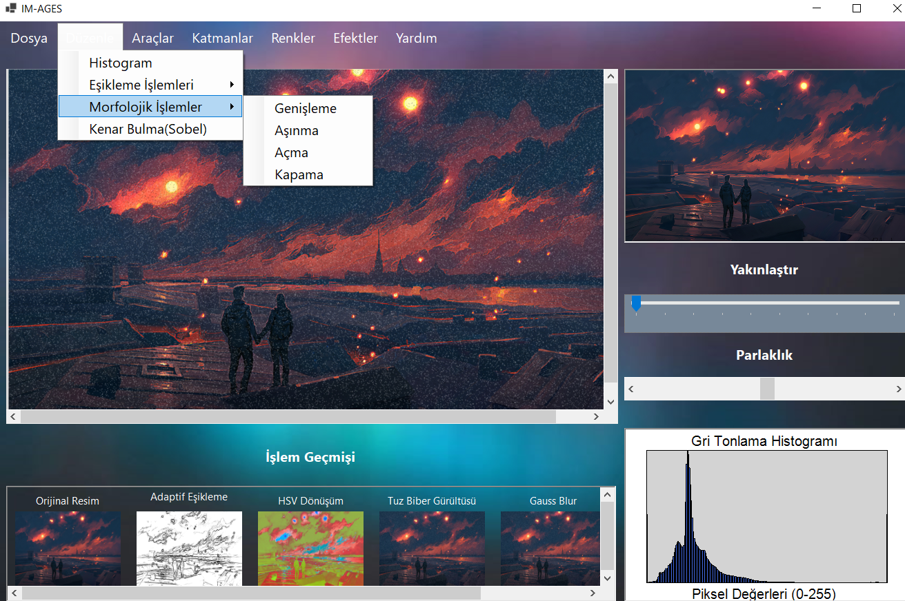
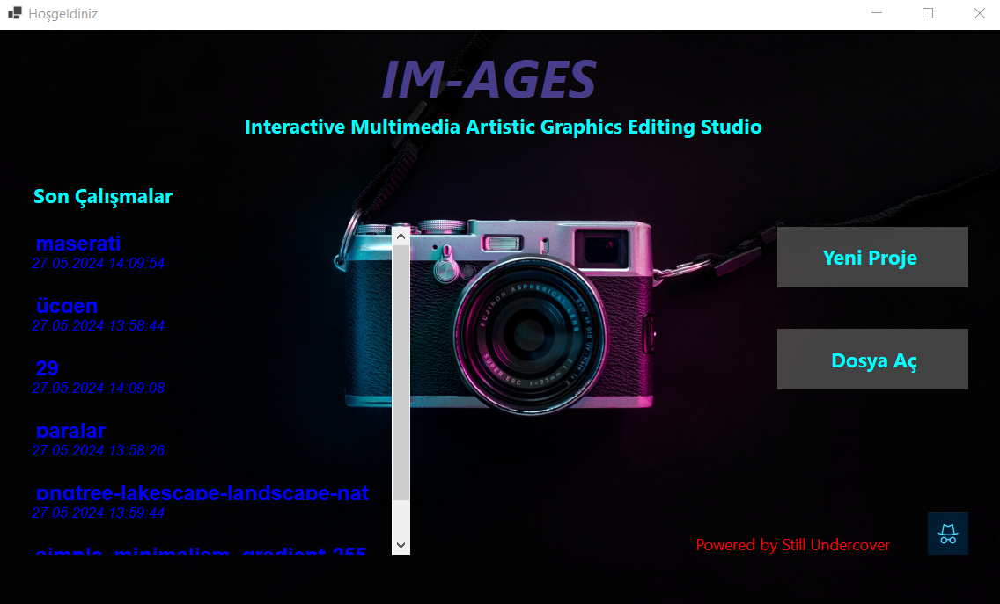
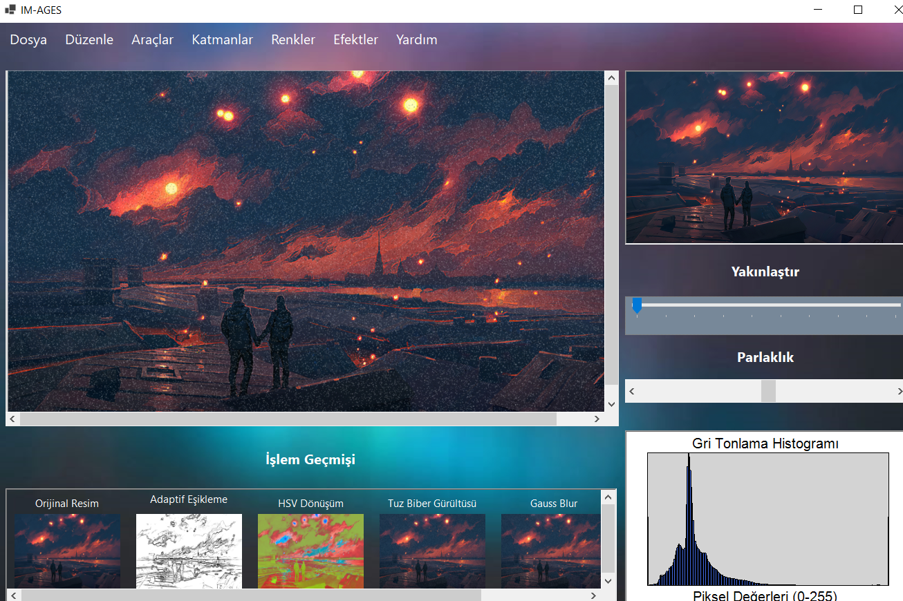
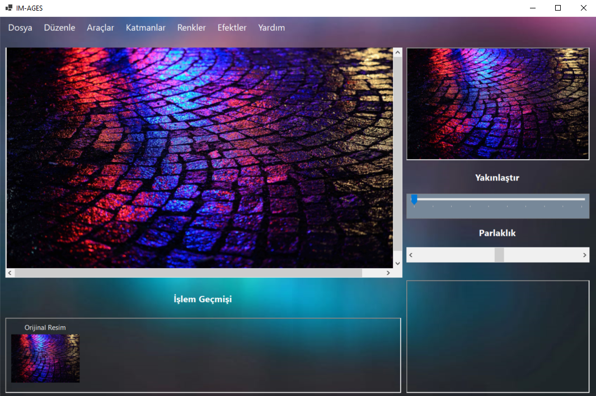

# IM-AGES: Digital Image Processing Studio

**🏆 1st Place Award Winner** *This project was selected as the #1 project among all submissions for the Selçuk University "Image Processing" course.*

IM-AGES is a comprehensive desktop application built with C# and WinForms that implements a wide array of fundamental and advanced image processing algorithms **entirely from scratch**. No external processing libraries (OpenCV or AForge.NET) were used; every algorithm is a clean-room implementation, demonstrating a deep, practical understanding of DIP (Digital Image Processing) theory.

## Core Architecture & Teamwork

This was a 4-person team project with a clear architectural vision. The primary development goal was to maintain a strict **Separation of Concerns (SoC)**.

* **UI Layer (`IM_AGES_Edit.cs`):** Acts as the central "controller" or "control tower," handling user interactions (button clicks, menu selections).
* **Logic Layer (Team Classes):** The UI layer delegates all processing tasks to static methods within dedicated classes for each team member (`Furkan.cs`, `Ismail.cs`, `Mustafa.cs`, `Alperen.cs`).

The project lead (Yusuf Furkan Umutlu) established this core architecture, defined the interfaces, and implemented the advanced morphological and geometric algorithms. Each team member was then responsible for implementing and optimizing their assigned algorithms within their own class, which were then integrated into the main editor.

## Unique Editor Tools

Beyond the standard algorithms, IM-AGES features powerful editor tools that set it apart:

### 1. Advanced Zoom & Pan Tool
A custom picture box component was developed to allow for high-magnification zoom and panning *within* the editor forms. 

### 2. Visual Operation History (Undo/Redo)
The application maintains a visual history (similar to Photoshop's) of all applied operations. This allows the user to see the effect of each step, click on any previous state to revert (Undo), and re-apply changes, providing a non-destructive workflow.

---

## Complete Algorithm Implementation (From Scratch)

All features listed below are implemented by manually manipulating pixel data (e.g., `GetPixel`, `SetPixel`, and bitmap locking for performance).

### 1. Point Processing & Basic Transforms
* **Grayscale Conversion** (Multiple methods)
* **Image Negative** (Invert)
* **Brightness** Adjustment
* **Contrast** Enhancement
* **Image Flipping** (Horizontal & Vertical)
* **Image Mirroring**

### 2. Histograms
* **Histogram Calculation** (RGB and Grayscale)
* **Histogram Equalization** (To improve image contrast)

### 3. Spatial Filtering (Convolution)
* **Mean (Average) Filter** (For noise reduction)
* **Median Filter** (Highly effective for Salt & Pepper noise)
* **Gaussian Blur**
* **Sharpening Filter** (Using a Laplacian kernel)

### 4. Edge Detection
* **Basic Edge Detection** (Laplacian)
* **Prewitt Operator** (Detects horizontal and vertical edges)
* **Sobel Operator** (More robust edge detection)

### 5. Morphological Operations
* **Dilation** (Genişletme)
* **Erosion** (Aşındırma)
* **Opening** (Erosion followed by Dilation, removes noise)
* **Closing** (Dilation followed by Erosion, fills holes)

### 6. Geometric Transforms
* **Image Rotation** (With user-defined angle)
* **Image Scaling (Zoom)** (Nearest-neighbor or bilinear interpolation)

### 7. Noise Simulation
* **Salt & Pepper Noise** (Adds random white and black pixels)

### 8. Advanced Algorithms
* **Skeletonization (İskelet Çıkarma):** A significant feature. Implements an iterative thinning algorithm (e.g., Zhang-Suen) to find the topological skeleton of a binary image.

## Technologies Used

* **Language:** C#
* **Framework:** .NET Framework
* **Platform:** Windows Forms (WinForms)
* **Core API:** `System.Drawing` (Bitmap, Color)

## How to Run

1.  Clone the repository: `git clone https://github.com/yufurkan/IM-AGES.git`
2.  Open the `IM-AGES.sln` solution file in Visual Studio 2022.
3.  Build the solution (Ctrl+Shift+B).
4.  Run the project (F5).

## Gallery

| Entry Page | Main Menu | Image Selection |
| :---: | :---: | :---: |
|  |  |  |

## The Team

* **Yusuf Furkan Umutlu** (Project Lead & Architect | Morphological, Geometric, & Skeletonization Algorithms)
* **Mustafa Nahsan** (Advanced Filtering, Edge Detection & Histograms)
* **İsmail Sarıteke** (Basic Filtering & Noise Algorithms)
* **Alperen Atar** (Point Processing & Basic Transforms)